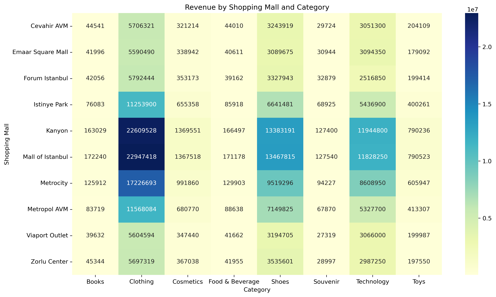
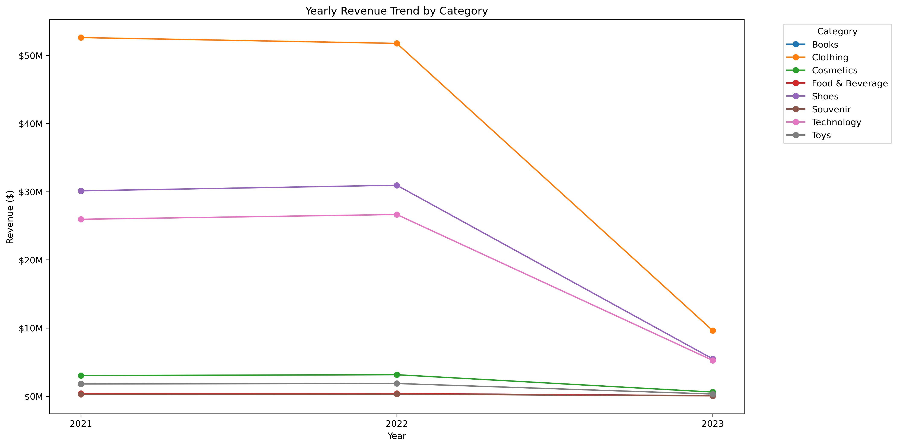
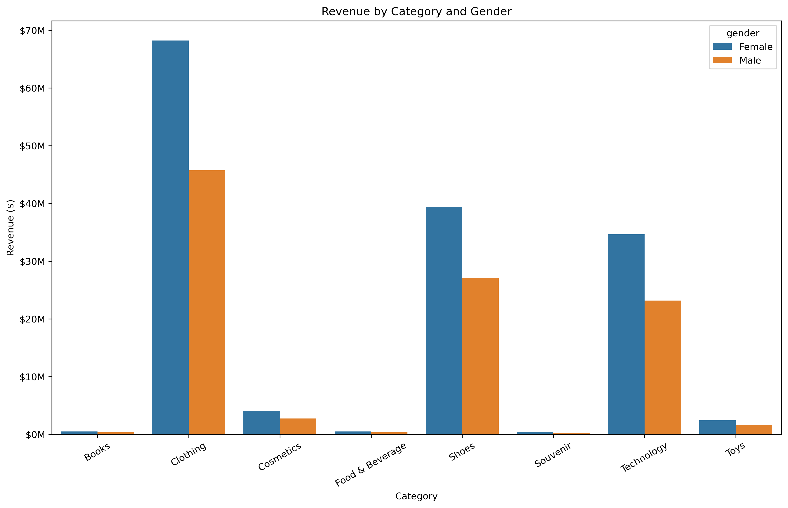

# Multi-Dimensional Retail Analytics on Istanbul Shopping Data

## Project Overview

This project focuses on analyzing retail shopping data from different shopping malls in Istanbul.

The main goal of this project is to understand customer spending patterns by looking at different dimensions such as:

- Product categories
- Shopping malls
- Payment methods
- Gender
- Yearly trends
- Monthly revenue changes

The project was completed using Python and several data analysis and visualization libraries.

---

## Dataset

The dataset contains **99,457 shopping transactions** from different shopping malls in Istanbul.

It contains 10 columns:

- `invoice_no` – Unique invoice number
- `customer_id` – Unique customer ID
- `gender` – Customer gender
- `age` – Customer age
- `category` – Product category
- `quantity` – Number of products purchased
- `price` – Unit price of the product
- `payment_method` – Payment method used
- `invoice_date` – Date of the transaction
- `shopping_mall` – Shopping mall where the purchase was made

The dataset includes:

- 10 shopping malls
- 8 product categories
- 3 payment methods
- 2 gender groups
- Transactions from 2021 to 2023

---

## Tools and Technologies

The following tools and libraries were used in this project:

- Python
- Pandas
- NumPy
- Matplotlib
- Seaborn
- Jupyter Notebook

---

## Project Structure

```text
Multi-Dimensional-Retail-Analytics/
│
├── data/
│   ├── customer_shopping_data(1).csv
│   └── cleaned_customer_shopping_data.csv
│
├── Retail_Analytics_Istanbul.ipynb
├── README.md
├── note.md
│
└── visualizations/
    ├── revenue_by_mall_category.png
    ├── yearly_revenue_trend.png
    └── revenue_by_gender_category.png
```

---

## Data Cleaning and Preparation

First, the dataset was loaded using Pandas and checked for basic data quality issues.

The dataset was checked for:

- Missing values
- Duplicate rows
- Data types
- Unique values
- Basic statistics

There were **no missing values** and **no duplicate rows** in the dataset.

The `invoice_date` column was converted into datetime format.

Additional time-related columns were created:

- `year`
- `month`
- `month_name`
- `year_month`

A new `revenue` column was also created using:

```python
df["revenue"] = df["quantity"] * df["price"]
```

This represents the total value of each transaction.

After preprocessing, the cleaned dataset was saved in the `data` folder as:

```text
data/cleaned_customer_shopping_data.csv
```

---

## Analysis

### 1. Revenue by Product Category

The total revenue was calculated for each product category.

The results showed that **Clothing** generated the highest total revenue, followed by **Shoes** and **Technology**.

| Category | Total Revenue |
|---|---:|
| Clothing | $113,996,791.04 |
| Shoes | $66,553,451.47 |
| Technology | $57,862,350.00 |
| Cosmetics | $6,792,862.90 |
| Toys | $3,980,426.24 |
| Food & Beverage | $849,535.05 |
| Books | $834,552.90 |
| Souvenir | $635,824.65 |

The average purchase amount was also calculated for each category.

Technology had the highest average transaction value, while Clothing had the highest overall revenue.

---

### 2. Revenue by Shopping Mall

Revenue was grouped by shopping mall to compare their overall performance.

| Shopping Mall | Total Revenue |
|---|---:|
| Mall of Istanbul | $50,872,481.68 |
| Kanyon | $50,554,231.10 |
| Metrocity | $37,302,787.33 |
| Metropol AVM | $25,379,913.19 |
| Istinye Park | $24,618,827.68 |
| Zorlu Center | $12,901,053.82 |
| Cevahir AVM | $12,645,138.20 |
| Viaport Outlet | $12,521,339.72 |
| Emaar Square Mall | $12,406,100.29 |
| Forum Istanbul | $12,303,921.24 |

Mall of Istanbul had the highest total revenue in the dataset.

The average purchase amount was also compared between malls. Emaar Square Mall had the highest average transaction value.

---

### 3. Revenue by Payment Method

The dataset contains three payment methods:

- Cash
- Credit Card
- Debit Card

Cash had the highest total revenue and the highest number of transactions.

| Payment Method | Transactions | Total Revenue |
|---|---:|---:|
| Cash | 44,447 | $112,832,200 |
| Credit Card | 34,931 | $88,077,120 |
| Debit Card | 20,079 | $50,596,430 |

The average transaction value was relatively similar across all three payment methods.

---

### 4. Revenue by Gender

Customer spending was also analyzed by gender.

| Gender | Transactions | Revenue |
|---|---:|---:|
| Female | 59,482 | $150,207,100 |
| Male | 39,975 | $101,298,700 |

Female customers represent around **59.81%** of all transactions, while male customers represent around **40.19%**.

The average transaction values were very close:

- Female: approximately $2,525
- Male: approximately $2,534

This means that the difference in total revenue is mainly related to the difference in the number of transactions rather than a large difference in average transaction value.

---

## Mall × Category Analysis

A pivot table was created to compare revenue across shopping malls and product categories.

```python
pd.pivot_table(
    df,
    values="revenue",
    index="shopping_mall",
    columns="category",
    aggfunc="sum",
    fill_value=0
)
```

A heatmap was then created to make the differences easier to understand.

### Revenue by Shopping Mall and Category



The heatmap shows that Clothing generated high revenue across all shopping malls.

Shoes and Technology were also important categories across most malls.

---

## Yearly Revenue Trend

Revenue was analyzed by year and product category.

The dataset contains data from 2021, 2022, and part of 2023.

A line chart was created to visualize the yearly changes.

### Yearly Revenue Trend by Category



The results show that revenue levels in 2021 and 2022 were relatively similar for most categories.

Clothing remained the largest category by revenue, while Shoes and Technology also generated significant revenue.

The 2023 values are lower because the dataset only contains a partial year for 2023. Therefore, 2023 should not be directly compared with the complete 2021 and 2022 years.

---

## Gender × Category Analysis

Revenue was also compared by both gender and product category.

### Revenue by Category and Gender



The chart shows that female customers generated higher total revenue in every product category.

Clothing had the highest revenue for both groups, followed by Shoes and Technology.

However, this analysis represents total revenue, so it should not be interpreted as saying that one gender spends more per individual transaction.

---

# Bonus Analysis

## 1. Month-over-Month Revenue Growth

Monthly revenue was calculated for each shopping mall.

The month-over-month growth formula used was:

```text
MoM Growth = ((Current Month Revenue - Previous Month Revenue)
             / Previous Month Revenue) × 100
```

The previous month's revenue was calculated using:

```python
df.groupby("shopping_mall")["revenue"].shift(1)
```

This allowed the revenue growth of each mall to be compared month by month.

The analysis showed that monthly revenue can change considerably between different months and shopping malls.

One important limitation is that **March 2023 is an incomplete month in the dataset**. Because of this, March 2023 creates unusually large month-over-month changes and should be treated carefully when interpreting the results.

---

## 2. Dominant Payment Method by Category

The payment method was also analyzed for each product category.

The result was:

| Category | Dominant Payment Method |
|---|---|
| Books | Cash |
| Clothing | Cash |
| Cosmetics | Cash |
| Food & Beverage | Cash |
| Shoes | Cash |
| Souvenir | Cash |
| Technology | Cash |
| Toys | Cash |

Cash was the dominant payment method for all product categories based on total revenue.

This does not mean that cash customers necessarily spend more per transaction. Cash also had the highest number of transactions in the dataset.

---

# Key Findings

Some of the main findings from the analysis are:

1. **Clothing generated the highest total revenue.**
2. **Technology had the highest average transaction value.**
3. **Mall of Istanbul had the highest total mall revenue.**
4. **Emaar Square Mall had the highest average purchase value.**
5. **Cash was the most frequently used payment method.**
6. **Female customers generated higher total revenue because they represented a larger share of transactions.**
7. **The average transaction values for male and female customers were very similar.**
8. **Clothing was a major revenue category across almost all shopping malls.**
9. **Shoes and Technology were also important revenue-generating categories.**
10. **2023 revenue should be interpreted carefully because the dataset only contains part of the year.**

---

# Business Interpretation

The analysis can provide some useful insights for retail businesses.

Clothing, Shoes, and Technology generate a large part of the total revenue, so these categories could receive more attention when planning inventory and promotions.

The differences between total revenue and average transaction value also show why both metrics are important. A category or mall can generate high total revenue because it has many transactions, while another can have a higher average purchase value.

The mall-by-category analysis can also help identify which product categories perform strongly in different shopping malls.

Payment method analysis shows that cash is still an important payment method in this dataset.

---

# Limitations

There are several limitations that should be considered when interpreting the results:

- The dataset represents transactions rather than detailed customer behavior.
- The data does not contain product-level cost information, so profit cannot be calculated.
- 2023 is only partially covered.
- The dataset does not provide information about marketing campaigns, discounts, or promotions.
- Revenue analysis does not necessarily represent profitability.
- The gender analysis is based on the gender categories available in the dataset.

---

# How to Run the Project

1. Download or clone the repository.
2. Make sure Python is installed.
3. Install the required libraries:

```bash
pip install pandas numpy matplotlib seaborn jupyter
```

4. Open Jupyter Notebook:

```bash
jupyter notebook
```

5. Open:

```text
Retail_Analytics_Istanbul.ipynb
```

6. Make sure the dataset is inside the `data` folder.

7. Run the notebook cells in order.

---

# Saving the Cleaned Dataset

The cleaned dataset can be saved using:

```python
df.to_csv("data/cleaned_customer_shopping_data.csv", index=False)
```

This keeps the original dataset unchanged and stores the processed version separately.

---

# Saving Visualizations

The visualizations were saved in the `visualizations` folder using:

```python
plt.savefig(
    "visualizations/revenue_by_mall_category.png",
    dpi=300,
    bbox_inches="tight"
)
```

The same approach was used for the other charts.

---

# Conclusion

This project provided a multi-dimensional analysis of Istanbul shopping mall transactions.

By using Pandas, Matplotlib, and Seaborn, the dataset was cleaned, transformed, analyzed, and visualized from different perspectives.

The analysis covered product categories, shopping malls, payment methods, gender, and yearly trends. The bonus analysis also examined month-over-month revenue growth and the dominant payment method for each category.

Overall, the project helped demonstrate how data analysis and visualization can be used to find patterns and useful insights in a large retail dataset.
